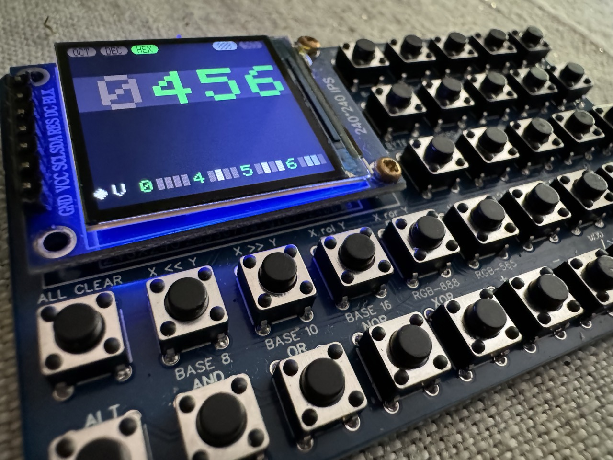
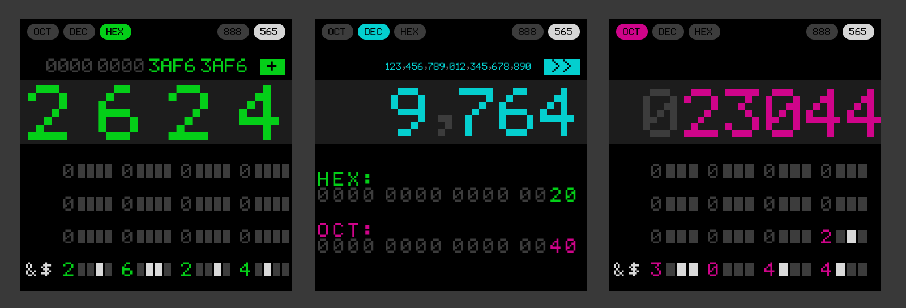
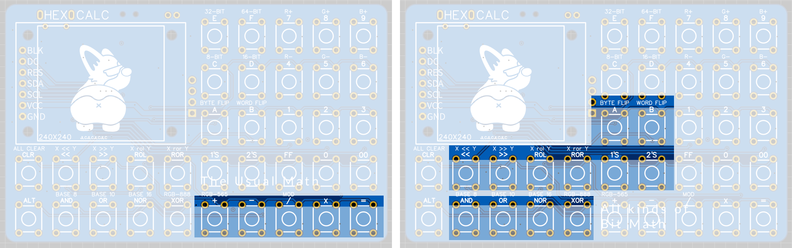
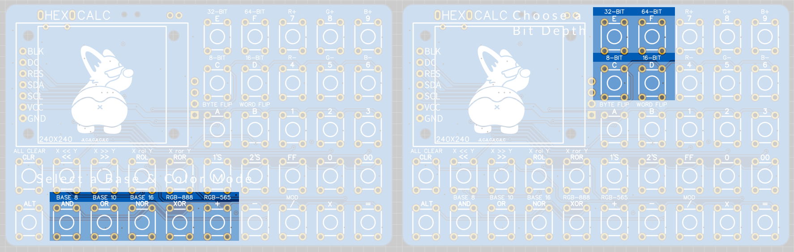
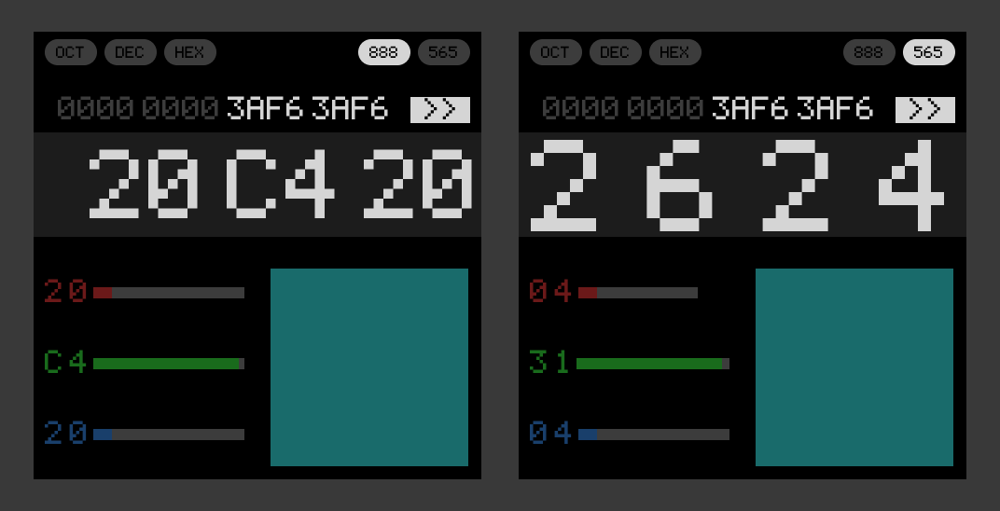
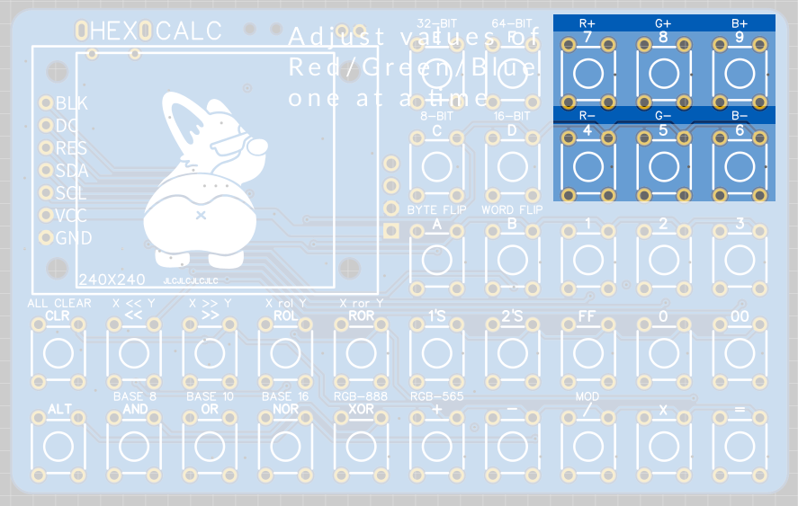
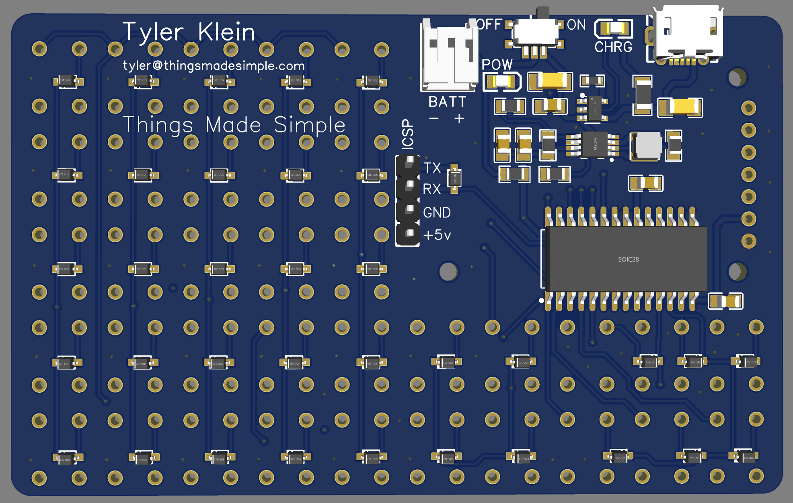
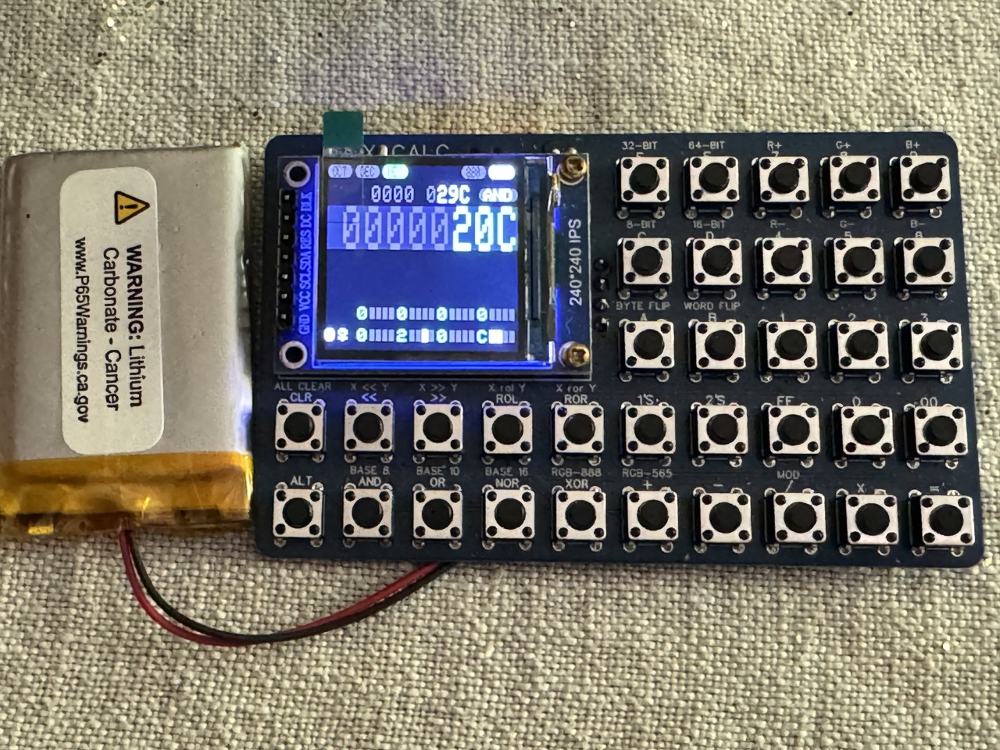

# HexCalc

This is a calculator the size of a business card. But it’s no ordinary calculator, it’s a calculator designed for micro-controller developers.

## Choose Your Base
Working with numbers in computers can be a confusing endeavor. We like to work in our ten-finger-based numbers, but computers that represent everything in zeros and ones need an extra layer of interpretation to better visualize them. Hexadecimal—which uses 4 bits per nibble—is the most common these days because our systems operate in multiples of 4—8-bit, 16 bit, 32 bit, 64 bit, etc. But back in the days of the UNIVAC and PDP-8, three-bits was the common divisor for their 6-bit, 12-bit, 24-bit and 48-bit words. Thus “Octal” was the standard.

The HexCalc works in each of these bases and makes it a little easier to visualize how these numbers are composed by their underlying bits. Simply punch in a number and a binary visualization appears below. In addition, the ASCII character that represents each 8-bit chunk appears on the left.

Conversion between bases is a snap. Just enter a number in one base and change the mode to another base and the new representation of that number will appear.

## Maths

Of course this is a “calculator” so it also does all the typical math stuff like add, subtract, multiply and divide. These functions are all integer based and not floating point—so there are no decimals. 

In addition to the basic stuff, the HexCalc also supports: 

* bit-math (AND / OR / NOR / XOR)
* Modulus
* Left / right shift and left / right rotate
* Byte-flip and word flip
* 1’s compliment
* 2’s compliment

## Bit Depth

Additionally, you can specify the bit-depth for the functions as 8-bit, 16-bit, 32-bit or 64-bit. This ensures that your numbers stay within the boundaries of your memory constraints and wrap around in the most confusing possible ways—just like in your C++ program!

## Seeing Color

Of course there is one more useful thing you can do with hexadecimal numbers—describe colors! The DevCalc provides separate modes for 16-bit and 24-bit color. 24-bit color is pretty straight forward—you get one byte for each color. But 16-bit color uses the 5-6-5 standard where green gets an extra bit (because our eyes are more sensitive to it).

Now you can dial in a 24-bit color and swap over to the equivalent-ish 16-bit color mode and get the color code. And, of course because the screen itself is uses native 16-bit color, you can ACTUALLY SEE what the color looks like in a preview on the screen! 

The color visualizer breaks down each color into its RGB components and there are separate buttons for incrementing / decrementing each color value. This is particularly useful in 16-bit color mode where the RGB values are interlaced across the 4 nibbles. 

## Hardware

The hardware leveragese the Li-Po Charger Boost circuit from sparkfun https://cdn.sparkfun.com/assets/5/b/9/a/3/LiPoChargerBooster5V1A_v10.pdf to power an AVR128DA28 microcontroller. 

The keyboard uses a matrix of microswitches and diodes connected directly to the microcontroller, and the screen is just one of those cheap SPI TFT screens that I ordered from AliExpress.

## Other Helpful Links
* [Project Files on OSHW LAB](https://oshwlab.com/tyler.klein/hexcalc)
* [Schematic](schematic/Schematic_HexCalc_2024-06-30.pdf)
* [Bill of Materials](schematic/HexCalc_BOM_2024-06-30.csv)

## Current Status...
* Electrically, the hardware seems to work. The only issue I've run into is that the holes on the footprint that I used are ever so slightly off. Honestly though, once you solder in the screen, you don't really need to screw in down. I may end up 3D-printing a shim to slot into the holes on both sides and ensure everything stays in place.
* The code... well... the code all seems to work, but it is UGLY. Sorry about that. What's that saying? Make it work, THEN make it fast (and pretty). Seriously though. I could probably consolidate a bunch of functions and that would make it much more readable.